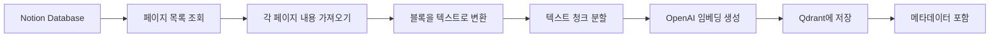

# RAG 파이프라인 통합 완료

## 개요

Notion 데이터베이스의 페이지 내용을 자동으로 가져와서 텍스트 청크로 분할하고, OpenAI 임베딩을 생성하여 Qdrant 벡터 데이터베이스에 저장하는 완전한 RAG(Retrieval-Augmented Generation) 파이프라인을 구현했습니다.

## 구현된 기능

### 1. RAG 서비스 구현

**파일**: [rag.service.ts](file:///Users/rio/Documents/code/rag-chat/src/rag/rag.service.ts)

핵심 기능:

- **Notion 페이지 수집**: 데이터베이스의 모든 페이지 조회
- **텍스트 추출**: Notion 블록을 평문 텍스트로 변환
- **청크 분할**: 긴 텍스트를 1000자 단위로 분할 (200자 오버랩)
- **임베딩 생성**: OpenAI `text-embedding-3-small` 모델 사용
- **벡터 저장**: Qdrant에 임베딩과 메타데이터 저장
- **중복 방지**: 이미 처리된 페이지는 자동으로 건너뜀

### 2. RAG 컨트롤러 구현

**파일**: [rag.controller.ts](file:///Users/rio/Documents/code/rag-chat/src/rag/rag.controller.ts)

API 엔드포인트:

- `POST /rag/ingest`: Notion 데이터베이스 내용을 임베딩하여 저장

요청 형식:

```json
{
  "databaseId": "your-notion-database-id"
}
```

응답 형식:

```json
{
  "success": true,
  "message": "임베딩 및 저장 완료",
  "pagesProcessed": 5,
  "pagesSkipped": 0,
  "chunksCreated": 12
}
```

### 3. Qdrant 서비스 확장

**파일**: [qdrant.service.ts](file:///Users/rio/Documents/code/rag-chat/src/qdrant/qdrant.service.ts)

추가된 메서드:

- `isPageExists()`: 특정 페이지가 이미 벡터 DB에 존재하는지 확인
- `scrollPoints()`: 필터 조건으로 포인트 조회

## 데이터 처리 흐름



## 저장되는 메타데이터

각 청크는 다음 정보와 함께 저장됩니다:

| 필드          | 설명                    | 예시                           |
| ------------- | ----------------------- | ------------------------------ |
| `text`        | 청크의 실제 텍스트 내용 | "이것은 첫 번째 청크입니다..." |
| `pageId`      | Notion 페이지 ID        | "abc123-def456-..."            |
| `pageUrl`     | Notion 페이지 URL       | "https://notion.so/..."        |
| `pageTitle`   | 페이지 제목             | "프로젝트 문서"                |
| `chunkIndex`  | 청크 순서               | 0, 1, 2, ...                   |
| `totalChunks` | 전체 청크 개수          | 5                              |

## 지원되는 Notion 블록 타입

다음 블록 타입에서 텍스트를 추출합니다:

- `paragraph` - 일반 문단
- `heading_1`, `heading_2`, `heading_3` - 제목
- `bulleted_list_item` - 글머리 기호 목록
- `numbered_list_item` - 번호 매기기 목록
- `to_do` - 체크리스트
- `toggle` - 토글 블록
- `quote` - 인용문
- `callout` - 콜아웃
- `code` - 코드 블록

## 텍스트 청킹 전략

**설정값**:

- 청크 크기: 1000자
- 오버랩: 200자

**동작 방식**:

1. 전체 텍스트를 1000자 단위로 분할
2. 각 청크는 이전 청크의 마지막 200자와 겹침
3. 문맥 연속성 유지로 검색 품질 향상

**예시**:

```
청크 1: [0-1000자]
청크 2: [800-1800자]  ← 200자 오버랩
청크 3: [1600-2600자] ← 200자 오버랩
```

## 사용 방법

### 1. 환경 변수 설정

`.env` 파일에 필요한 값들이 설정되어 있어야 합니다:

```env
NOTION_API_KEY=secret_...
NOTION_DATABASE_ID=...
OPENAI_API_KEY=sk-proj-...
QDRANT_HOST=localhost
QDRANT_PORT=6333
```

### 2. Qdrant 실행

```bash
docker-compose up -d
```

### 3. 서버 실행

```bash
npm run start:dev
```

### 4. 데이터 수집 실행

```bash
curl -X POST http://localhost:3001/rag/ingest \
  -H "Content-Type: application/json" \
  -d '{"databaseId": "your-database-id"}'
```

또는 Swagger UI 사용:

- URL: `http://localhost:3001/api`
- 엔드포인트: `POST /rag/ingest`

## 로그 출력 예시

```
[RagService] Starting ingestion for database: abc123...
[RagService] Found 3 pages
[RagService] Processing page: 프로젝트 문서 (page-id-1)
[RagService] Split into 4 chunks
[RagService] Completed processing page: 프로젝트 문서
[RagService] Processing page: 회의록 (page-id-2)
[RagService] Page "회의록" already exists in vector DB, skipping
[RagService] Ingestion complete. Total: 3 pages, Processed: 2, Skipped: 1, Chunks created: 8
```

## 중복 처리 방지

- 페이지 ID를 기준으로 이미 처리된 페이지인지 확인
- 이미 존재하는 페이지는 자동으로 건너뜀
- 재실행 시 새로운 페이지만 처리하여 효율성 향상

## 에러 처리

- 개별 페이지 처리 실패 시 해당 페이지만 건너뛰고 계속 진행
- 빈 페이지(텍스트 없음)는 자동으로 건너뜀
- 모든 에러는 로그에 기록됨

## 다음 단계

이제 RAG 파이프라인의 **수집(Ingestion)** 단계가 완료되었습니다. 다음으로 구현할 기능:

1. **검색(Retrieval)**: 사용자 질문과 유사한 벡터 검색
2. **생성(Generation)**: 검색된 컨텍스트를 기반으로 OpenAI로 답변 생성
3. **채팅 API**: 사용자 친화적인 질문-답변 엔드포인트
4. **프론트엔드**: 웹 인터페이스 구축

## 파일 구조

```
src/
├── rag/
│   ├── rag.module.ts
│   ├── rag.service.ts      ← 핵심 파이프라인 로직
│   └── rag.controller.ts   ← API 엔드포인트
├── notion/
│   ├── notion.module.ts
│   └── notion.service.ts   ← Notion API 연동
├── openai/
│   ├── openai.module.ts
│   └── openai.service.ts   ← 임베딩 생성
└── qdrant/
    ├── qdrant.module.ts
    └── qdrant.service.ts   ← 벡터 DB 연동
```
