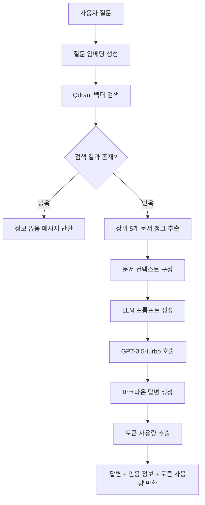

# LLM 기반 답변 생성 기능 구현

## 개요

사용자의 질문에 대해 검색된 문서를 기반으로 LLM(GPT-3.5-turbo)을 사용하여 자연어 답변을 생성하는 기능을 구현했습니다. 문서에 없는 정보는 절대 포함하지 않으며, 모든 답변은 마크다운 형식으로 구조화되어 제공됩니다.

## 구현된 기능

### 1. OpenAI 서비스 확장

**파일**: [openai.service.ts](file:///Users/rio/Documents/code/rag-chat/src/openai/openai.service.ts)

#### 추가된 메서드: `generateAnswer`

검색된 문서 컨텍스트를 기반으로 LLM을 사용하여 답변을 생성합니다.

**주요 특징**:

- **문서 기반 답변**: 제공된 문서에 있는 정보만을 사용하여 답변 생성
- **강력한 제약**: 시스템 프롬프트를 통해 문서 외 정보 사용을 엄격히 금지
- **마크다운 형식**: 제목, 리스트, 강조, 인용 등을 마크다운 문법으로 구조화
- **토큰 사용량 추적**: 프롬프트 토큰, 완성 토큰, 총 토큰 수를 반환

**메서드 시그니처**:

```typescript
async generateAnswer(
  question: string,
  contextDocuments: Array<{ text: string; pageTitle: string; pageUrl: string }>,
): Promise<{
  answer: string;
  usage: {
    promptTokens: number;
    completionTokens: number;
    totalTokens: number;
  };
}>
```

**시스템 프롬프트 규칙**:

1. 반드시 제공된 문서에 있는 정보만을 사용하여 답변
2. 문서에 없는 정보는 절대 포함하지 않음
3. 문서에 답변할 수 있는 정보가 없으면 명확히 안내
4. 답변 시 해당 정보가 어떤 문서에서 나왔는지 명확히 인용
5. 문서에 있는 정보를 바탕으로 추론하되, 문서에 명시되지 않은 사실은 추가하지 않음
6. 답변은 반드시 마크다운 형식으로 작성

**LLM 설정**:

- 모델: `gpt-3.5-turbo`
- Temperature: `0.3` (일관성 있는 답변을 위해 낮게 설정)
- Max Tokens: `1000`

### 2. RAG 서비스 개선

**파일**: [rag.service.ts](file:///Users/rio/Documents/code/rag-chat/src/rag/rag.service.ts)

#### 개선된 `query` 메서드

기존의 단순 검색 결과 반환에서 LLM을 통한 답변 생성으로 확장되었습니다.

**처리 흐름**:

1. 질문에 대한 임베딩 생성
2. Qdrant에서 유사한 청크 검색 (상위 5개)
3. 검색 결과가 없으면 적절한 메시지 반환
4. 검색된 문서들을 LLM에 전달할 형식으로 변환
5. LLM을 사용하여 문서 기반 답변 생성
6. 인용된 문서 정보와 토큰 사용량 포함하여 반환

**반환 형식**:

```typescript
{
  success: boolean;
  answer: string;              // 마크다운 형식의 답변
  sources: Array<{             // 인용된 문서 정보
    pageTitle: string;
    pageUrl: string;
    score: number;
    chunkText: string;
  }>;
  question: string;            // 원본 질문
  usage: {                     // 토큰 사용량
    promptTokens: number;
    completionTokens: number;
    totalTokens: number;
  };
}
```

### 3. Qdrant 서비스 개선

**파일**: [qdrant.service.ts](file:///Users/rio/Documents/code/rag-chat/src/qdrant/qdrant.service.ts)

#### 개선된 `search` 메서드

- 기본 검색 결과 개수를 3개에서 5개로 증가
- 더 많은 컨텍스트를 LLM에 제공하여 답변 품질 향상
- `limit` 파라미터를 옵션으로 추가하여 유연성 확보

### 4. 컨트롤러 업데이트

**파일**: [rag.controller.ts](file:///Users/rio/Documents/code/rag-chat/src/rag/rag.controller.ts)

#### API 문서 업데이트

- `POST /rag/query` 엔드포인트의 설명을 "LLM 기반 답변 생성 (문서 기반)"으로 업데이트
- Swagger 문서에 새로운 응답 형식 반영

## 데이터 처리 흐름



## 응답 형식 예시

### 성공 응답

```json
{
  "success": true,
  "answer": "## 프로젝트 개요\n\n[문서 1]에 따르면, 이 프로젝트는 다음과 같은 특징을 가지고 있습니다:\n\n- **목적**: RAG 시스템 구축\n- **기술 스택**: NestJS, OpenAI, Qdrant\n- **주요 기능**: Notion 문서 기반 질문-답변\n\n자세한 내용은 [문서 1](https://notion.so/...)을 참고하세요.",
  "sources": [
    {
      "pageTitle": "프로젝트 문서",
      "pageUrl": "https://notion.so/...",
      "score": 0.89,
      "chunkText": "이 프로젝트는 RAG(Retrieval-Augmented Generation) 시스템을 구축하는 것을 목표로 합니다. NestJS 프레임워크를 사용하여..."
    },
    {
      "pageTitle": "기술 스택",
      "pageUrl": "https://notion.so/...",
      "score": 0.85,
      "chunkText": "프로젝트에서 사용하는 주요 기술 스택은 다음과 같습니다: NestJS, OpenAI API, Qdrant 벡터 데이터베이스..."
    }
  ],
  "question": "이 프로젝트는 무엇인가요?",
  "usage": {
    "promptTokens": 1234,
    "completionTokens": 567,
    "totalTokens": 1801
  }
}
```

### 정보 없음 응답

```json
{
  "success": false,
  "answer": "제공된 문서에는 이 질문에 대한 정보가 없습니다.",
  "sources": []
}
```

### 오류 응답

```json
{
  "success": false,
  "answer": "답변 생성 중 오류가 발생했습니다.",
  "error": "OpenAI API 호출 실패: ...",
  "sources": []
}
```

## 주요 특징

### 1. 문서 기반 답변

- 제공된 문서에 있는 정보만을 사용하여 답변 생성
- 문서에 없는 정보는 절대 포함하지 않음
- 문서에 답변할 수 있는 정보가 없으면 명확히 안내

### 2. 강력한 제약

- 시스템 프롬프트를 통해 문서 외 정보 사용을 엄격히 금지
- 사용자 프롬프트에서도 문서만 참고하도록 명시

### 3. 마크다운 형식

- 제목, 리스트, 강조, 인용 등을 마크다운 문법으로 구조화
- 사용자가 쉽게 이해할 수 있도록 가독성 향상

### 4. 문서 인용

- 답변에 사용된 문서의 제목, URL, 관련도 점수 포함
- 각 문서의 청크 미리보기 제공

### 5. 토큰 사용량 추적

- 프롬프트 토큰, 완성 토큰, 총 토큰 수를 반환
- API 사용량 모니터링 및 비용 관리 가능

## 사용 방법

### 1. 환경 변수 설정

`.env` 파일에 OpenAI API 키가 설정되어 있어야 합니다:

```env
OPENAI_API_KEY=sk-proj-...
```

### 2. 서버 실행

```bash
npm run start:dev
```

### 3. 질문 요청

#### cURL 사용

```bash
curl -X POST http://localhost:3001/rag/query \
  -H "Content-Type: application/json" \
  -d '{"question": "이 프로젝트는 무엇인가요?"}'
```

#### Swagger UI 사용

- URL: `http://localhost:3001/api`
- 엔드포인트: `POST /rag/query`
- 요청 본문에 `question` 필드 입력

## 검증 방법

### 1. 기본 기능 테스트

```bash
# 질문 요청
curl -X POST http://localhost:3001/rag/query \
  -H "Content-Type: application/json" \
  -d '{"question": "프로젝트의 주요 기능은 무엇인가요?"}'
```

**예상 결과**:
- `success: true`
- `answer` 필드에 마크다운 형식의 답변 포함
- `sources` 배열에 인용된 문서 정보 포함
- `usage` 객체에 토큰 사용량 포함

### 2. 문서에 없는 정보 테스트

```bash
curl -X POST http://localhost:3001/rag/query \
  -H "Content-Type: application/json" \
  -d '{"question": "오늘 날씨는 어떤가요?"}'
```

**예상 결과**:
- `success: false` 또는 적절한 안내 메시지
- 문서에 없는 정보는 포함되지 않음

### 3. 토큰 사용량 확인

응답의 `usage` 객체에서 다음 정보 확인:
- `promptTokens`: 프롬프트에 사용된 토큰 수
- `completionTokens`: 답변 생성에 사용된 토큰 수
- `totalTokens`: 총 사용된 토큰 수

## 에러 처리

### 1. 검색 결과 없음

- 검색 결과가 없으면 `success: false`와 함께 적절한 메시지 반환
- `sources` 배열은 빈 배열로 반환

### 2. LLM API 오류

- OpenAI API 호출 실패 시 에러 메시지와 함께 반환
- 에러 정보는 `error` 필드에 포함

### 3. 예외 처리

- 모든 예외는 로그에 기록됨
- 사용자에게는 친화적인 에러 메시지 제공

## 성능 고려사항

### 1. 검색 결과 개수

- 기본적으로 상위 5개 문서 청크를 사용
- 더 많은 컨텍스트를 제공하여 답변 품질 향상
- 토큰 사용량과 답변 품질의 균형 고려

### 2. Temperature 설정

- `0.3`으로 설정하여 일관성 있는 답변 생성
- 문서 기반 답변이므로 창의성보다 정확성 중시

### 3. Max Tokens

- `1000` 토큰으로 제한하여 비용 관리
- 필요에 따라 조정 가능

## 다음 단계

이제 완전한 RAG 시스템이 구축되었습니다. 다음으로 고려할 수 있는 기능:

1. **대화 컨텍스트 유지**: 이전 대화 내용을 기억하는 채팅 기능
2. **스트리밍 응답**: 실시간으로 답변을 생성하여 반환
3. **답변 품질 평가**: 사용자 피드백을 통한 답변 품질 개선
4. **캐싱**: 동일한 질문에 대한 답변 캐싱으로 비용 절감
5. **프론트엔드**: 웹 인터페이스를 통한 사용자 친화적 UI

## 파일 구조

```
src/
├── openai/
│   ├── openai.module.ts
│   └── openai.service.ts      ← generateAnswer 메서드 추가
├── rag/
│   ├── rag.module.ts
│   ├── rag.service.ts         ← query 메서드 개선
│   └── rag.controller.ts      ← API 문서 업데이트
└── qdrant/
    ├── qdrant.module.ts
    └── qdrant.service.ts      ← search 메서드 개선
```

## 변경 사항 요약

1. **OpenAI 서비스**: `generateAnswer` 메서드 추가
2. **RAG 서비스**: `query` 메서드를 LLM 답변 생성으로 확장
3. **Qdrant 서비스**: 검색 결과 개수 증가 (3개 → 5개)
4. **컨트롤러**: API 문서 업데이트
5. **타입 정의**: `SearchResult` 인터페이스 export 추가

---

_이 Walkthrough는 프로젝트 `Walkthrough/06-llm-answer-generation.md` 파일에 저장되었습니다._

