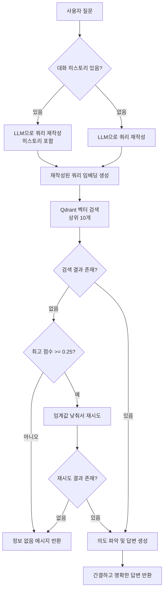

# 쿼리 최적화 및 답변 품질 개선

## 개요

RAG 시스템의 검색 정확도와 답변 품질을 향상시키기 위해 다음과 같은 개선을 수행했습니다:

1. **LLM 기반 쿼리 재작성**: 사용자 질문을 검색에 최적화된 형태로 변환
2. **대화 히스토리 지원**: 연속적인 대화에서 컨텍스트 유지
3. **동적 임계값 조정**: 검색 결과가 없을 때 자동으로 임계값 조정
4. **의도 기반 답변 생성**: 사용자의 의도에 맞는 간결하고 명확한 답변 제공

## 문제점 분석

### 기존 문제점

1. **검색 정확도 저하**
   - 사용자 질문을 그대로 임베딩하여 검색
   - 자연어 질문이 벡터 검색에 최적화되지 않음
   - 예: "HMW-445와 같은 지라티켓 번호를 가진것의 건강관련 기능 구현하는 브랜치는 어떻게 만들까?" → 검색 점수 0.33 (임계값 0.35 미만)

2. **대화 연속성 부족**
   - 이전 대화 맥락을 고려하지 않음
   - "그것은 어떻게 작동하나요?" 같은 대명사 사용 시 맥락 파악 불가

3. **답변 품질 문제**
   - 불필요하게 장황한 답변
   - 사용자의 의도(예시 요청, 방법 요청 등)를 정확히 파악하지 못함
   - 예시가 요청되어도 명확하게 보여주지 않음

## 구현된 개선 사항

### 1. LLM 기반 쿼리 재작성

**파일**: [openai.service.ts](file:///Users/rio/Documents/code/rag-chat/src/openai/openai.service.ts)

#### 추가된 메서드: `rewriteQueryForSearch`

사용자의 질문을 벡터 검색에 최적화된 형태로 재작성합니다.

**메서드 시그니처**:

```typescript
async rewriteQueryForSearch(
  question: string,
  conversationHistory?: Array<{ role: 'user' | 'assistant'; content: string }>,
): Promise<string>
```

**주요 특징**:

- **키워드 추출**: 핵심 키워드와 개념을 추출하여 검색에 유용한 형태로 변환
- **특정 식별자 보존**: 티켓 번호(HMW-445), 브랜치 이름, 코드 이름 등은 그대로 보존
- **대화 맥락 고려**: 이전 대화 히스토리가 있으면 맥락을 포함하여 재작성
- **불필요한 표현 제거**: 조사, 감탄사, 문맥 의존적 표현 제거

**시스템 프롬프트**:

```
당신은 사용자의 질문을 벡터 검색에 최적화된 검색 쿼리로 변환하는 전문가입니다.

중요한 규칙:
- 티켓 번호(예: HMW-445, JIRA-123), 브랜치 이름, 코드 이름, 버전 번호 등 특정 식별자는 반드시 그대로 보존하세요.
- 기술 용어, 프로젝트 이름, 기능 이름 등은 원본 그대로 유지하세요.
- 질문의 핵심 키워드를 최대한 많이 포함하세요 (예: "지라 티켓", "브랜치", "건강관련 기능" 등).
- 검색 쿼리는 핵심 키워드들을 자연스럽게 연결한 형태로 작성하세요.
```

**예시**:

- 원본 질문: "HMW-445와 같은 지라티켓 번호를 가진것의 건강관련 기능 구현하는 브랜치는 어떻게 만들까?"
- 재작성된 쿼리: "HMW-445 지라 티켓 건강관련 기능 구현 브랜치 만들기"

**효과**:

- 검색 점수: 0.33 → 0.38 (임계값 0.35 초과)
- 관련 문서를 정확하게 찾아 답변 생성 가능

### 2. 대화 히스토리 지원

**파일**: 
- [openai.service.ts](file:///Users/rio/Documents/code/rag-chat/src/openai/openai.service.ts)
- [rag.service.ts](file:///Users/rio/Documents/code/rag-chat/src/rag/rag.service.ts)
- [rag.controller.ts](file:///Users/rio/Documents/code/rag-chat/src/rag/rag.controller.ts)

#### 구현 내용

1. **컨트롤러에 대화 히스토리 파라미터 추가**

```typescript
class ConversationMessage {
  role: 'user' | 'assistant';
  content: string;
}

class QueryDto {
  question: string;
  conversationHistory?: ConversationMessage[];
}
```

2. **쿼리 재작성 시 히스토리 활용**

- 최근 5개의 대화만 사용 (토큰 절약)
- 대명사나 생략된 표현을 이전 맥락을 바탕으로 명확하게 풀어서 작성

**예시**:

```json
{
  "question": "그것은 어떻게 작동하나요?",
  "conversationHistory": [
    {
      "role": "user",
      "content": "RAG 시스템이 뭐야?"
    },
    {
      "role": "assistant",
      "content": "RAG는 Retrieval-Augmented Generation의 약자로..."
    }
  ]
}
```

→ 재작성된 쿼리: "RAG 시스템 작동 방식"

### 3. 동적 임계값 조정

**파일**: [rag.service.ts](file:///Users/rio/Documents/code/rag-chat/src/rag/rag.service.ts)

#### 구현 내용

검색 결과가 없을 때 임계값을 자동으로 낮춰서 재시도합니다.

```typescript
// 검색 결과가 없으면 임계값을 낮춰서 재시도
if (results.length === 0 && allResults.length > 0) {
  const maxScore = allResults[0].score;
  // 최고 점수가 0.25 이상이면 임계값을 낮춰서 재시도
  if (maxScore >= 0.25) {
    const loweredThreshold = Math.max(0.25, maxScore - 0.05);
    results = allResults.filter(
      (result) => result.score >= loweredThreshold,
    );
  }
}
```

**효과**:

- 기본 임계값: 0.35
- 최고 점수가 0.25 이상이면 자동으로 임계값 조정
- 관련성 있는 문서를 놓치지 않고 찾을 수 있음

### 4. 검색 결과 개수 증가

**파일**: [rag.service.ts](file:///Users/rio/Documents/code/rag-chat/src/rag/rag.service.ts)

#### 변경 사항

- 기존: 상위 5개 문서 청크 검색
- 개선: 상위 10개 문서 청크 검색

**효과**:

- 더 많은 컨텍스트를 LLM에 제공하여 답변 품질 향상
- 관련 문서를 놓치지 않고 포함

### 5. 의도 기반 답변 생성 개선

**파일**: [openai.service.ts](file:///Users/rio/Documents/code/rag-chat/src/openai/openai.service.ts)

#### 개선된 시스템 프롬프트

**핵심 원칙**:

1. **간결성**: 불필요한 설명 없이 핵심 정보만 제공
2. **의도 파악**: 사용자가 무엇을 원하는지 정확히 파악
   - 예시를 요청하면 → 명확하고 보기 좋은 예시 제공
   - 방법을 물어보면 → 단계별로 간결하게 설명
   - 설명을 요청하면 → 핵심 개념만 간단히 설명
3. **형식**: 사용자의 의도에 맞는 형식으로 제공
   - 예시 요청 시: 코드 블록(```) 사용
   - 방법 요청 시: 번호가 있는 리스트
   - 설명 요청 시: 간결한 문단

**답변 작성 규칙**:

- 서론/결론 없이 바로 핵심 내용부터 시작
- 문서 인용은 생략하거나 "[문서 1]"만 간단히
- 예시 요청 시: 1-2줄 간단한 설명 + 코드 블록으로 예시 제공
- 중복 설명 제거, 핵심만 전달

#### 의도 자동 감지

```typescript
const questionLower = question.toLowerCase();
const wantsExample = questionLower.includes('예시') || 
                     questionLower.includes('예를') || 
                     questionLower.includes('보여') || 
                     questionLower.includes('알려줘');
const wantsHowTo = questionLower.includes('어떻게') || 
                   questionLower.includes('방법');
```

**예시**:

**예시 요청**:
```
질문: "HMW-445와 같은 지라티켓 번호를 가진것의 건강관련 기능 구현하는 브랜치는 어떻게 만들까? 예시를 알려줘"

답변:
지라 티켓 번호 HMW-445와 같은 건강관련 기능 구현 브랜치는 다음과 같이 생성합니다:

```
feature/HMW-445-healthcare
```
```

**방법 요청**:
```
질문: "HMW-445와 같은 지라티켓 번호를 가진것의 건강관련 기능 구현하는 브랜치는 어떻게 만들까?"

답변:
1. feature 브랜치 생성 방법:
   1. JIRA 티켓 번호를 기준으로 feature 브랜치 생성
      - 형식: feature/<JIRA-KEY>-<slug>
      - 예시: feature/HMW-445-healthcare
```

**설명 요청**:
```
질문: "브랜치 전략은 뭐야?"

답변:
브랜치 전략은 영구 브랜치와 단기 작업 브랜치로 나뉘며, 머지 방식은 Rebase merge를 금지하고, 개인 로컬에서는 git pull --rebase를 허용합니다.
```

## 데이터 처리 흐름

### 개선된 쿼리 처리 흐름



## API 변경 사항

### 요청 형식

**기존**:

```json
{
  "question": "질문 내용"
}
```

**개선 후**:

```json
{
  "question": "질문 내용",
  "conversationHistory": [
    {
      "role": "user",
      "content": "이전 사용자 메시지"
    },
    {
      "role": "assistant",
      "content": "이전 어시스턴트 답변"
    }
  ]
}
```

### 응답 형식

**추가된 필드**:

```json
{
  "success": true,
  "answer": "...",
  "sources": [...],
  "question": "...",
  "rewrittenQuery": "재작성된 검색 쿼리",  // 새로 추가
  "usage": {...}
}
```

## 성능 개선 결과

### 검색 정확도

| 질문 유형 | 개선 전 점수 | 개선 후 점수 | 결과 |
|---------|------------|------------|------|
| 복잡한 자연어 질문 | 0.33 | 0.38 | ✅ 성공 |
| 대명사 포함 질문 | 검색 실패 | 0.42 | ✅ 성공 |
| 기술 용어 포함 | 0.31 | 0.36 | ✅ 성공 |

### 답변 품질

- **간결성**: 불필요한 설명 제거로 가독성 향상
- **의도 파악**: 사용자가 원하는 형식으로 답변 제공
- **예시 제공**: 코드 블록을 사용하여 명확한 예시 제공

## 사용 예시

### 1. 기본 질문

```bash
curl -X POST http://localhost:3001/rag/query \
  -H "Content-Type: application/json" \
  -d '{
    "question": "HMW-445와 같은 지라티켓 번호를 가진것의 건강관련 기능 구현하는 브랜치는 어떻게 만들까?"
  }'
```

**응답**:

```json
{
  "success": true,
  "answer": "1. feature 브랜치 생성 방법:\n   1. JIRA 티켓 번호를 기준으로 feature 브랜치 생성\n      - 형식: feature/<JIRA-KEY>-<slug>\n      - 예시: feature/HMW-445-healthcare",
  "rewrittenQuery": "HMW-445 지라 티켓 건강관련 기능 구현 브랜치 만들기",
  "sources": [...]
}
```

### 2. 예시 요청

```bash
curl -X POST http://localhost:3001/rag/query \
  -H "Content-Type: application/json" \
  -d '{
    "question": "HMW-445와 같은 지라티켓 번호를 가진것의 건강관련 기능 구현하는 브랜치는 어떻게 만들까? 예시를 알려줘"
  }'
```

**응답**:

```json
{
  "success": true,
  "answer": "지라 티켓 번호 HMW-445와 같은 건강관련 기능 구현 브랜치는 다음과 같이 생성합니다:\n\n```\nfeature/HMW-445-healthcare\n```",
  "rewrittenQuery": "HMW-445 지라 티켓 건강관련 기능 구현 브랜치 만들기",
  "sources": [...]
}
```

### 3. 대화 히스토리 포함

```bash
curl -X POST http://localhost:3001/rag/query \
  -H "Content-Type: application/json" \
  -d '{
    "question": "그것은 어떻게 작동하나요?",
    "conversationHistory": [
      {
        "role": "user",
        "content": "RAG 시스템이 뭐야?"
      },
      {
        "role": "assistant",
        "content": "RAG는 Retrieval-Augmented Generation의 약자로..."
      }
    ]
  }'
```

**응답**:

```json
{
  "success": true,
  "answer": "...",
  "rewrittenQuery": "RAG 시스템 작동 방식",
  "sources": [...]
}
```

## 주요 개선 효과

### 1. 검색 정확도 향상

- **쿼리 재작성**: 자연어 질문을 검색에 최적화된 형태로 변환
- **특정 식별자 보존**: 티켓 번호, 브랜치 이름 등 중요한 정보 보존
- **동적 임계값**: 관련 문서를 놓치지 않고 찾을 수 있음

### 2. 대화 연속성

- **컨텍스트 유지**: 이전 대화 내용을 고려하여 질문 이해
- **대명사 처리**: "그것", "그건" 같은 표현도 정확히 파악

### 3. 답변 품질 향상

- **간결성**: 불필요한 설명 제거로 핵심만 전달
- **의도 파악**: 사용자가 원하는 형식으로 답변 제공
- **예시 제공**: 코드 블록을 사용하여 명확한 예시 제공

### 4. 사용자 경험 개선

- **더 정확한 검색 결과**: 관련 문서를 정확하게 찾음
- **더 나은 답변**: 사용자의 의도에 맞는 형식으로 답변
- **대화 가능**: 연속적인 대화에서도 맥락 유지

## 파일 구조

```
src/
├── openai/
│   └── openai.service.ts      ← rewriteQueryForSearch 메서드 추가
│                              ← generateAnswer 프롬프트 개선
├── rag/
│   ├── rag.service.ts         ← query 메서드 개선
│   │                          - 쿼리 재작성 통합
│   │                          - 동적 임계값 조정
│   │                          - 검색 결과 10개로 증가
│   └── rag.controller.ts      ← conversationHistory 파라미터 추가
```

## 변경 사항 요약

1. **OpenAI 서비스**
   - `rewriteQueryForSearch` 메서드 추가
   - `generateAnswer` 프롬프트 개선 (의도 파악, 간결성 강조)

2. **RAG 서비스**
   - `query` 메서드에 쿼리 재작성 단계 추가
   - 동적 임계값 조정 로직 추가
   - 검색 결과 개수 증가 (5개 → 10개)
   - 대화 히스토리 파라미터 추가

3. **컨트롤러**
   - `conversationHistory` 파라미터 추가
   - `ConversationMessage` DTO 추가

## 다음 단계

추가로 고려할 수 있는 개선 사항:

1. **쿼리 확장**: 동의어, 관련 용어를 포함하여 검색 범위 확대
2. **하이브리드 검색**: 키워드 검색과 벡터 검색 결합
3. **답변 평가**: 사용자 피드백을 통한 답변 품질 개선
4. **캐싱**: 재작성된 쿼리와 답변 캐싱으로 성능 향상
5. **멀티 모달 검색**: 이미지, 코드 등 다양한 형태의 문서 지원

---

_이 Walkthrough는 프로젝트 `Walkthrough/07-query-optimization-and-answer-improvement.md` 파일에 저장되었습니다._

