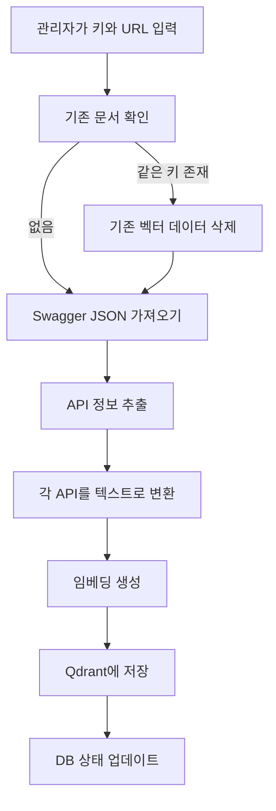

# Swagger 문서 업로드 기능 구현

## 개요

관리자가 Swagger JSON URL을 입력받아 API 정보를 자동으로 파싱하고 벡터DB에 저장하는 기능을 구현했습니다. 일반 문서와 구분하여 관리하며, API 추천 기능의 기반이 됩니다.

## 주요 기능

- 📤 **Swagger 문서 업로드**: Swagger JSON URL을 입력받아 API 정보 자동 추출 및 벡터화
- 🔑 **사용자 지정 키 관리**: URL이 변경되어도 같은 키로 관리 가능
- 📋 **상세 API 정보 저장**: 파라미터, 요청 본문, 응답 스키마 등 상세 정보 포함
- 🔄 **자동 업데이트**: 같은 키로 재업로드 시 기존 데이터 자동 삭제 후 재업로드
- 🔍 **필터링 지원**: 키 기반으로 벡터DB에서 필터링 가능

## 작업 내용

### 1. SwaggerDocument 엔티티 생성

Swagger 문서 메타데이터를 저장할 엔티티를 생성했습니다.

**`src/swagger/entities/swagger-document.entity.ts`**

```typescript
@Entity('swagger_documents')
export class SwaggerDocument {
  @PrimaryGeneratedColumn('uuid')
  id: string;

  @Column({ unique: true })
  key: string; // 사용자 지정 키 (고유 식별자)

  @Column()
  swaggerUrl: string; // Swagger JSON URL

  @Column({ type: 'varchar', length: 500, nullable: true })
  title: string | null; // Swagger 문서 제목 (info.title)

  @Column({ type: 'varchar', length: 500, nullable: true })
  version: string | null; // Swagger 문서 버전 (info.version)

  @Column({ type: 'text', nullable: true })
  description: string | null; // Swagger 문서 설명 (info.description)

  @Column({ type: 'int', default: 0 })
  apiCount: number; // 벡터 DB에 저장된 API 개수

  @Column({
    type: 'enum',
    enum: SwaggerIndexingStatus,
    default: SwaggerIndexingStatus.PENDING,
  })
  @Index()
  indexingStatus: SwaggerIndexingStatus; // 인덱싱 상태

  @Column({ type: 'timestamp', nullable: true })
  lastIndexedAt: Date | null; // 마지막 인덱싱 시간

  @Column({ type: 'text', nullable: true })
  errorMessage: string | null; // 인덱싱 실패 시 에러 메시지

  @CreateDateColumn()
  createdAt: Date;

  @UpdateDateColumn()
  updatedAt: Date;
}
```

**주요 필드 설명:**
- `key`: 사용자 지정 키 (고유 식별자, 소문자, 숫자, 언더스코어만 허용)
- `swaggerUrl`: Swagger JSON URL (고유하지 않음, URL 변경 가능)
- `indexingStatus`: 인덱싱 상태 추적 (`pending`, `processing`, `completed`, `failed`)
- `apiCount`: 벡터 DB에 저장된 API 개수

### 2. SwaggerService 구현

Swagger JSON을 파싱하고 벡터화하는 서비스를 구현했습니다.

**`src/swagger/swagger.service.ts`**

#### 2.1 Swagger JSON 가져오기

```typescript
private async fetchSwaggerSpec(url: string): Promise<SwaggerSpec> {
  const response = await fetch(url);
  if (!response.ok) {
    throw new Error(`Failed to fetch Swagger spec: ${response.statusText}`);
  }
  return await response.json();
}
```

#### 2.2 API 정보 추출

Swagger 스펙의 `paths`에서 각 엔드포인트의 정보를 추출합니다.

```typescript
private extractApisFromSwagger(spec: SwaggerSpec): ApiInfo[] {
  const apis: ApiInfo[] = [];
  
  for (const [path, methods] of Object.entries(spec.paths)) {
    for (const [method, details] of Object.entries(methods)) {
      // HTTP 메서드만 추출
      if (!['get', 'post', 'put', 'patch', 'delete'].includes(method.toLowerCase())) {
        continue;
      }
      
      const apiInfo: ApiInfo = {
        method: method.toUpperCase(),
        path,
        summary: details.summary || '',
        description: details.description || '',
        tags: details.tags || [],
        operationId: details.operationId,
        parameters: details.parameters,
        requestBody: details.requestBody,
        responses: details.responses,
      };
      
      apis.push(apiInfo);
    }
  }
  
  return apis;
}
```

#### 2.3 상세 정보 텍스트 변환

파라미터, 요청 본문, 응답 정보를 읽기 쉬운 텍스트로 변환합니다.

**파라미터 정보:**
```typescript
private parametersToText(parameters: any[]): string {
  // 각 파라미터의 이름, 위치, 타입, 필수 여부, 설명, 예시 포함
}
```

**요청 본문 정보:**
```typescript
private requestBodyToText(requestBody: any, schemas?: Record<string, any>): string {
  // Content-Type, 스키마 정보, 예시 포함
}
```

**응답 정보:**
```typescript
private responsesToText(responses: any, schemas?: Record<string, any>): string {
  // 응답 코드별 스키마, 예시 포함
}
```

**스키마 참조 처리:**
```typescript
private schemaToText(schema: any, schemas?: Record<string, any>): string {
  // $ref 참조 자동 해결
  // 객체 속성, 배열 아이템 타입 등 상세 정보 추출
}
```

#### 2.4 벡터화 및 저장

각 API를 벡터화하여 Qdrant에 저장합니다.

```typescript
async uploadSwaggerDocument(key: string, swaggerUrl: string) {
  // 1. 기존 문서 확인 (key 기준)
  // 2. Swagger JSON 가져오기
  // 3. DB에 메타데이터 저장
  // 4. API 정보 추출
  // 5. 각 API를 벡터화하여 저장
  // 6. DB 상태 업데이트
}
```

**저장되는 벡터 정보:**
- 임베딩 벡터 (OpenAI `text-embedding-3-small`)
- Payload:
  - 기본 정보: `endpoint`, `method`, `path`, `summary`, `description`, `tags`
  - 식별 정보: `swaggerKey`, `swaggerDocumentId`, `swaggerUrl`
  - 상세 정보: `parameters`, `parametersText`, `requestBody`, `requestBodyText`, `responses`, `responsesText`
  - 전체 텍스트: `fullText` (임베딩에 사용된 텍스트)

### 3. SwaggerController 구현

관리자용 API 엔드포인트를 구현했습니다.

**`src/swagger/swagger.controller.ts`**

#### API 엔드포인트

**`POST /swagger/upload`** - Swagger 문서 업로드

요청:
```json
{
  "key": "rag_chat_api",
  "swaggerUrl": "http://localhost:3001/api-json"
}
```

응답:
```json
{
  "success": true,
  "message": "Swagger 문서가 성공적으로 업로드되었습니다.",
  "swaggerDocument": {
    "id": "uuid",
    "key": "rag_chat_api",
    "swaggerUrl": "http://localhost:3001/api-json",
    "title": "RAG Chat API",
    "version": "1.0",
    "apiCount": 25,
    "indexingStatus": "completed"
  },
  "apiCount": 25
}
```

**`GET /swagger/documents`** - Swagger 문서 목록 조회

응답:
```json
{
  "success": true,
  "documents": [
    {
      "id": "uuid",
      "key": "rag_chat_api",
      "swaggerUrl": "http://localhost:3001/api-json",
      "title": "RAG Chat API",
      "apiCount": 25,
      "indexingStatus": "completed",
      "lastIndexedAt": "2025-01-01T00:00:00.000Z"
    }
  ],
  "total": 1
}
```

**`GET /swagger/documents/:id`** - 특정 Swagger 문서 조회

**`DELETE /swagger/documents/:id`** - Swagger 문서 삭제

### 4. QdrantService 확장

Swagger 문서 삭제를 위한 메서드를 추가했습니다.

**`src/qdrant/qdrant.service.ts`**

```typescript
async deleteSwaggerDocumentPoints(
  collectionName: string,
  swaggerDocumentId: string,
): Promise<number> {
  // swaggerDocumentId로 필터링하여 모든 벡터 포인트 삭제
}
```

### 5. 데이터베이스 마이그레이션

**`src/database/migrations/1764002000000-CreateSwaggerDocumentTable.ts`**

`swagger_documents` 테이블 생성

**`src/database/migrations/1764003000000-AddKeyToSwaggerDocument.ts`**

`key` 컬럼 추가 및 `swaggerUrl`의 unique 제거

## 사용 방법

### 1. 마이그레이션 실행

```bash
npm run migration:run
```

### 2. Swagger 문서 업로드

```bash
curl -X POST http://localhost:3001/swagger/upload \
  -H "Content-Type: application/json" \
  -H "Authorization: Bearer {admin_token}" \
  -d '{
    "key": "rag_chat_api",
    "swaggerUrl": "http://localhost:3001/api-json"
  }'
```

### 3. 문서 목록 조회

```bash
curl -X GET http://localhost:3001/swagger/documents \
  -H "Authorization: Bearer {admin_token}"
```

### 4. 문서 삭제

```bash
curl -X DELETE http://localhost:3001/swagger/documents/{documentId} \
  -H "Authorization: Bearer {admin_token}"
```

## 주요 특징

### 1. 사용자 지정 키 기반 관리

- **키 규칙**: 소문자 영어, 숫자, 언더스코어(`_`)만 허용
- **고유성**: 키는 고유 식별자로 사용
- **URL 변경 대응**: 같은 키로 재업로드하면 URL이 바뀌어도 기존 데이터 업데이트

### 2. 상세 API 정보 저장

벡터DB에 저장되는 정보:

- **기본 정보**: 엔드포인트, 메서드, 경로, 요약, 설명, 태그
- **파라미터**: 이름, 위치, 타입, 필수 여부, 설명, 예시
- **요청 본문**: Content-Type, 스키마, 예시
- **응답**: 응답 코드별 스키마, 예시
- **스키마 참조**: `$ref` 자동 해결, 중첩 객체 속성 추출

### 3. 벡터DB 필터링 지원

저장된 `swaggerKey`를 사용하여 필터링 가능:

```typescript
// 특정 Swagger 문서의 API만 검색
const filter = {
  must: [{
    key: 'swaggerKey',
    match: { value: 'rag_chat_api' }
  }]
};
```

### 4. 일반 문서와 구분

- **일반 문서**: `documentType` 없음 또는 다른 값
- **API 문서**: `documentType: 'API'`
- **컬렉션 분리**: `notion_pages` (일반 문서) vs `api_recommendations` (API)

### 5. 에러 처리

- 개별 API 처리 실패 시에도 계속 진행
- 실패한 API는 로그에 기록
- 전체 실패 시 DB 상태를 `failed`로 업데이트

## 데이터 저장 구조

### Qdrant 벡터 저장

**컬렉션**: `api_recommendations`

**포인트 구조**:
```json
{
  "id": "uuid",
  "vector": [0.1, 0.2, ...],
  "payload": {
    "endpoint": "POST /auth/register",
    "method": "POST",
    "path": "/auth/register",
    "summary": "회원가입",
    "description": "새로운 사용자 계정을 생성합니다",
    "tags": ["인증", "사용자"],
    "swaggerKey": "rag_chat_api",
    "swaggerDocumentId": "uuid",
    "swaggerUrl": "http://localhost:3001/api-json",
    "parameters": [...],
    "parametersText": "파라미터 상세 정보...",
    "requestBody": {...},
    "requestBodyText": "요청 본문 상세 정보...",
    "responses": {...},
    "responsesText": "응답 상세 정보...",
    "fullText": "전체 API 정보 텍스트...",
    "documentType": "API"
  }
}
```

### 데이터베이스 저장

**테이블**: `swagger_documents`

| 컬럼 | 타입 | 설명 |
|------|------|------|
| id | UUID | 고유 ID |
| key | VARCHAR(100) | 사용자 지정 키 (고유) |
| swaggerUrl | VARCHAR(500) | Swagger JSON URL |
| title | VARCHAR(500) | 문서 제목 |
| version | VARCHAR(500) | 문서 버전 |
| apiCount | INT | 저장된 API 개수 |
| indexingStatus | ENUM | 인덱싱 상태 |
| lastIndexedAt | TIMESTAMP | 마지막 인덱싱 시간 |

## 처리 흐름



## 검증

### 1. 키 검증

- 형식: `/^[a-z0-9_]+$/` (소문자, 숫자, 언더스코어만)
- 길이: 최소 1자, 최대 100자
- 고유성: DB에서 중복 확인

### 2. URL 검증

- 프로토콜 필수 (`http://` 또는 `https://`)
- TLD 불필요 (localhost 허용)
- 유효한 URL 형식

### 3. Swagger 스펙 검증

- JSON 형식 확인
- `paths` 객체 존재 확인
- API 개수 확인 (0개면 실패)

## 주의사항

1. **대량 API 처리**: API가 많을 경우 처리 시간이 오래 걸릴 수 있습니다.
2. **임베딩 비용**: 각 API마다 OpenAI 임베딩 API 호출로 비용 발생
3. **재업로드**: 같은 키로 재업로드하면 기존 데이터가 완전히 삭제됩니다.
4. **에러 복구**: 개별 API 실패는 건너뛰지만, 전체 실패 시 수동 재시도 필요

## 향후 개선 사항

1. **배치 처리**: 여러 API를 묶어서 처리하여 성능 향상
2. **진행률 추적**: 대량 처리 시 진행률 표시
3. **부분 업데이트**: 변경된 API만 선택적으로 업데이트
4. **캐싱**: 같은 URL의 Swagger JSON 캐싱
5. **태그 필터링**: 특정 태그의 API만 업로드

## 파일 구조

```
src/
├── swagger/
│   ├── entities/
│   │   └── swagger-document.entity.ts    <-- SwaggerDocument 엔티티
│   ├── swagger.service.ts                 <-- Swagger 파싱 및 벡터화 로직
│   ├── swagger.controller.ts              <-- 관리자용 API 엔드포인트
│   └── swagger.module.ts                  <-- Swagger 모듈
├── qdrant/
│   └── qdrant.service.ts                  <-- deleteSwaggerDocumentPoints 메서드 추가
└── database/
    └── migrations/
        ├── 1764002000000-CreateSwaggerDocumentTable.ts
        └── 1764003000000-AddKeyToSwaggerDocument.ts
```

## API 엔드포인트 요약

| 메서드 | 엔드포인트 | 설명 | 권한 |
|--------|-----------|------|------|
| POST | `/swagger/upload` | Swagger 문서 업로드 | ADMIN, SUB_ADMIN |
| GET | `/swagger/documents` | 문서 목록 조회 | ADMIN, SUB_ADMIN |
| GET | `/swagger/documents/:id` | 특정 문서 조회 | ADMIN, SUB_ADMIN |
| DELETE | `/swagger/documents/:id` | 문서 삭제 | ADMIN, SUB_ADMIN |

## 다음 단계

이제 Swagger 문서 업로드 기능이 완성되었습니다. 다음으로 구현할 기능:

1. **API 추천 기능**: 사용자 질문에 맞는 API 추천
2. **프로젝트별 필터링**: 프로젝트별로 다른 Swagger 문서 관리
3. **권한 기반 필터링**: 사용자 권한에 따라 접근 가능한 API만 추천

---

_이 Walkthrough는 프로젝트 `Walkthrough/14-swagger-document-upload.md` 파일에 저장되었습니다._

