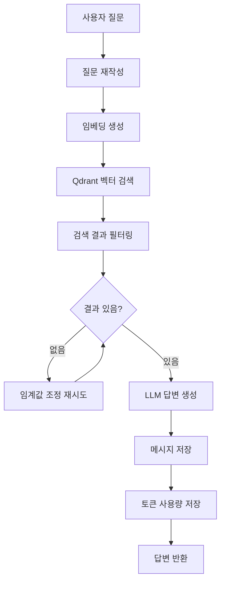

# Swagger API 질문 답변 기능 구현

## 개요

Swagger API 문서를 기반으로 사용자의 질문에 답변하는 기능을 구현했습니다. API 사용법, 예시, 테스트 데이터 등을 제공하며, 기존 RAG 문서 검색과 동일하게 대화 히스토리 관리 및 토큰 사용량 추적 기능을 포함합니다.

## 주요 기능

- 🔍 **API 질문 답변**: Swagger API 문서를 기반으로 질문에 답변
- 💬 **대화 히스토리 지원**: 연속적인 대화에서 컨텍스트 유지
- 📊 **토큰 사용량 추적**: 자동으로 토큰 사용량 추적 및 저장
- 💾 **메시지 자동 저장**: 질문과 답변을 자동으로 DB에 저장
- 🎯 **특정 문서 필터링**: 특정 Swagger 문서의 API만 검색 가능
- 📋 **구조화된 답변**: 표 형식과 JSON으로 가독성 높은 답변 제공

## 작업 내용

### 1. OpenAI 서비스 확장

Swagger API 질문에 특화된 답변 생성 메서드를 추가했습니다.

**`src/openai/openai.service.ts`**

#### 1.1 generateApiAnswer 메서드 추가

```typescript
async generateApiAnswer(
  question: string,
  contextApis: Array<{
    endpoint: string;
    method: string;
    path: string;
    summary: string;
    description: string;
    tags: string[];
    parameters?: any;
    parametersText?: string;
    requestBody?: any;
    requestBodyText?: string;
    responses?: any;
    responsesText?: string;
    fullText: string;
    swaggerKey?: string;
    swaggerUrl?: string;
  }>,
  conversationHistory?: Array<{
    role: 'user' | 'assistant';
    content: string;
  }>,
): Promise<{
  answer: string;
  usage: {
    promptTokens: number;
    completionTokens: number;
    totalTokens: number;
  };
}>
```

**주요 특징:**
- Swagger API 정보를 구조화된 형식으로 처리
- 질문 유형별 맞춤 답변 (사용법, 예시, 테스트 데이터 등)
- 대화 히스토리 지원
- 토큰 사용량 추적

#### 1.2 프롬프트 최적화

**구조화된 답변 형식:**
- 마크다운 제목(##, ###)으로 섹션 구분
- 표 형식으로 파라미터, 헤더, 필드 설명
- JSON 코드 블록으로 요청/응답 본문 표시
- 요청 정보와 응답 정보를 명확히 구분
- 에러 응답을 별도 섹션으로 표시

**답변 형식 예시:**
```
### API 정보
- **엔드포인트**: `POST /auth/register`
- **설명**: 회원가입 API

### 요청 정보
#### 파라미터
| 이름 | 타입 | 위치 | 필수 | 설명 | 예시 |
|------|------|------|------|------|------|
| email | string | body | 예 | 이메일 주소 | user@example.com |

#### 요청 본문
```json
{
  "email": "user@example.com",
  "password": "password123"
}
```

### 응답 정보
#### 성공 응답 (200 OK)
```json
{
  "success": true,
  "data": { ... }
}
```

#### 에러 응답
**400 Bad Request:**
```json
{
  "error": "잘못된 요청",
  "message": "..."
}
```
```

**프롬프트 설계 원칙:**
- 코드 예시 제거 (curl, JavaScript, Python 등) - 가독성 향상
- 구조화된 마크다운 형식 사용
- 표 형식으로 정보 표시
- API 인용을 자연스럽게 문맥에 포함

### 2. SwaggerService 확장

API 질문 처리 메서드를 추가했습니다.

**`src/swagger/swagger.service.ts`**

#### 2.1 query 메서드 구현

```typescript
async query(
  question: string,
  conversationHistory?: Array<{
    role: 'user' | 'assistant';
    content: string;
  }>,
  swaggerKey?: string, // 특정 Swagger 문서만 검색하고 싶을 때
): Promise<{
  success: boolean;
  answer: string;
  sources: Array<{
    endpoint: string;
    method: string;
    path: string;
    score: number;
    swaggerKey?: string;
  }>;
  question: string;
  rewrittenQuery?: string;
  usage?: {
    promptTokens: number;
    completionTokens: number;
    totalTokens: number;
  };
  maxScore?: number;
  threshold?: number;
  error?: string;
}>
```

**처리 흐름:**
1. 질문을 검색에 최적화된 쿼리로 재작성
2. 재작성된 쿼리에 대한 임베딩 생성
3. Qdrant에서 유사한 API 검색 (필터링 지원)
4. 검색 결과 필터링 (최소 스코어 임계값)
5. 동적 임계값 조정 (결과가 없을 경우)
6. LLM을 사용하여 API 기반 답변 생성
7. 사용된 API 인덱스 추출 및 소스 반환

**주요 특징:**
- 벡터 검색을 통한 관련 API 찾기
- 특정 Swagger 문서 필터링 지원 (`swaggerKey` 파라미터)
- 동적 임계값 조정으로 검색 정확도 향상
- 토큰 사용량 추적

#### 2.2 extractUsedApiIndices 메서드

답변에서 실제로 사용된 API 번호를 추출합니다.

```typescript
private extractUsedApiIndices(answer: string): Set<number> {
  const usedIndices = new Set<number>();
  const apiPattern = /\[API\s*(\d+)\]/g;
  let match: RegExpExecArray | null;
  
  while ((match = apiPattern.exec(answer)) !== null) {
    if (match[1]) {
      const apiIndex = parseInt(match[1], 10);
      if (!isNaN(apiIndex)) {
        usedIndices.add(apiIndex);
      }
    }
  }
  
  return usedIndices;
}
```

### 3. SwaggerController 확장

API 질문 엔드포인트를 추가했습니다.

**`src/swagger/swagger.controller.ts`**

#### 3.1 POST /swagger/query 엔드포인트 추가

```typescript
@Post('query')
@UseGuards(JwtAuthGuard)
@HttpCode(HttpStatus.OK)
@ApiOperation({
  summary: 'Swagger API 질문 답변',
  description:
    'Swagger API 문서를 기반으로 질문에 답변합니다. API 사용법, 예시, 테스트 데이터 등을 제공합니다.',
})
async queryApi(
  @Request() req: { user: { id: string } },
  @Body() body: ApiQueryDto,
)
```

**요청 DTO:**
```typescript
class ApiQueryDto {
  question: string;
  conversationId?: string; // 기존 대화 이어가기
  conversationHistory?: ConversationMessage[]; // 대화 히스토리
  swaggerKey?: string; // 특정 Swagger 문서만 검색
}
```

**응답 형식:**
```json
{
  "success": true,
  "answer": "답변 내용...",
  "sources": [
    {
      "endpoint": "POST /auth/register",
      "method": "POST",
      "path": "/auth/register",
      "score": 0.85,
      "swaggerKey": "rag_chat_api"
    }
  ],
  "question": "회원가입 API는 어떻게 사용하나요?",
  "rewrittenQuery": "회원가입 API 사용법",
  "usage": {
    "promptTokens": 500,
    "completionTokens": 200,
    "totalTokens": 700
  },
  "conversationId": "uuid"
}
```

**주요 기능:**
- 대화 히스토리 자동 관리 (`conversationId` 없으면 새 대화 생성)
- 질문 메시지 자동 저장
- 답변 메시지 자동 저장 (소스, 토큰 사용량 포함)
- 토큰 사용량 자동 추적 및 저장

### 4. 모듈 의존성 추가

SwaggerModule에 필요한 모듈을 추가했습니다.

**`src/swagger/swagger.module.ts`**

```typescript
@Module({
  imports: [
    TypeOrmModule.forFeature([SwaggerDocument]),
    OpenAIModule,
    QdrantModule,
    ConversationModule, // 추가
    TokenUsageModule, // 추가
  ],
  controllers: [SwaggerController],
  providers: [SwaggerService],
  exports: [SwaggerService],
})
export class SwaggerModule {}
```

## 사용 방법

### 1. 기본 질문

```bash
curl -X POST http://localhost:3001/swagger/query \
  -H "Content-Type: application/json" \
  -H "Authorization: Bearer {token}" \
  -d '{
    "question": "회원가입 API는 어떻게 사용하나요?"
  }'
```

### 2. 대화 히스토리 포함

```bash
curl -X POST http://localhost:3001/swagger/query \
  -H "Content-Type: application/json" \
  -H "Authorization: Bearer {token}" \
  -d '{
    "question": "그 API의 테스트 데이터 알려줘",
    "conversationId": "이전_응답에서_받은_conversationId"
  }'
```

### 3. 특정 Swagger 문서만 검색

```bash
curl -X POST http://localhost:3001/swagger/query \
  -H "Content-Type: application/json" \
  -H "Authorization: Bearer {token}" \
  -d '{
    "question": "노션 페이지 생성 API의 모든 파라미터를 알려줘",
    "swaggerKey": "rag_chat_api"
  }'
```

## 질문 유형별 답변 예시

### 1. API 사용법 질문

**질문:** "회원가입 API는 어떻게 사용하나요?"

**답변 형식:**
- API 정보 (엔드포인트, 설명)
- 요청 정보 (파라미터 표, 헤더 표, 요청 본문 JSON, 필드 설명)
- 응답 정보 (성공 응답 JSON, 응답 필드 설명, 에러 응답 JSON)

### 2. 테스트 데이터 요청

**질문:** "테스트 데이터 알려줘"

**답변 형식:**
- 테스트 데이터 섹션
- 유효한 JSON 형식의 테스트 데이터
- 필수 필드 포함
- 실제 사용 가능한 값 사용

### 3. 여러 API 조합 질문

**질문:** "노션 데이터베이스에서 페이지를 가져온 다음, 그 페이지를 업데이트하는 방법을 알려줘"

**답변 형식:**
- 단계별로 각 API 설명
- 각 단계마다 요청/응답 정보 포함
- 전체 플로우 설명

### 4. API 찾기 질문

**질문:** "회원가입 관련 API가 있나요?"

**답변 형식:**
- 관련 API 목록
- 각 API의 엔드포인트, 메서드, 요약, 설명

## 주요 특징

### 1. RAG와 동일한 기능

- ✅ 대화 히스토리 자동 관리
- ✅ 메시지 자동 저장 (질문/답변)
- ✅ 토큰 사용량 자동 추적 및 저장
- ✅ 대화 연속성 지원

### 2. 구조화된 답변

- 표 형식으로 파라미터/헤더/필드 정보 표시
- JSON 코드 블록으로 요청/응답 본문 표시
- 요청 정보와 응답 정보를 명확히 구분
- 에러 응답을 별도 섹션으로 표시

### 3. 가독성 향상

- 코드 예시 제거 (curl, JavaScript, Python 등)
- 마크다운 형식으로 구조화
- API 인용을 자연스럽게 문맥에 포함
- 불필요한 설명 제거

### 4. 검색 최적화

- 질문을 검색에 최적화된 쿼리로 재작성
- 벡터 검색을 통한 관련 API 찾기
- 동적 임계값 조정
- 특정 Swagger 문서 필터링 지원

## 데이터 흐름



## 처리 흐름

1. **질문 수신**: 사용자가 API 질문을 제출
2. **대화 관리**: `conversationId`가 있으면 기존 대화 로드, 없으면 새 대화 생성
3. **질문 메시지 저장**: 사용자 질문을 DB에 저장
4. **질문 재작성**: LLM을 사용하여 검색에 최적화된 쿼리로 재작성
5. **임베딩 생성**: 재작성된 쿼리에 대한 임베딩 생성
6. **벡터 검색**: Qdrant에서 유사한 API 검색 (필터링 지원)
7. **결과 필터링**: 최소 스코어 임계값 이상인 결과만 선택
8. **동적 조정**: 결과가 없으면 임계값을 낮춰서 재시도
9. **답변 생성**: LLM을 사용하여 API 기반 답변 생성
10. **답변 메시지 저장**: 답변과 메타데이터를 DB에 저장
11. **토큰 추적**: 토큰 사용량을 DB에 저장
12. **응답 반환**: 답변과 소스 정보를 반환

## 검증

### 1. 질문 재작성 검증

- 원본 질문의 의미 보존
- 핵심 키워드 추출
- 대화 히스토리 고려

### 2. 벡터 검색 검증

- 관련 API 정확도 확인
- 필터링 기능 동작 확인
- 동적 임계값 조정 동작 확인

### 3. 답변 품질 검증

- 구조화된 형식 준수
- 정확한 API 정보 제공
- 가독성 확인

### 4. 대화 관리 검증

- 대화 히스토리 연속성 확인
- 메시지 저장 확인
- 토큰 사용량 추적 확인

## 주의사항

1. **토큰 사용량**: 각 질문마다 여러 번의 LLM 호출 (재작성, 임베딩, 답변 생성)
2. **검색 정확도**: 벡터 검색 결과에 따라 답변 품질이 달라질 수 있음
3. **대화 관리**: `conversationId`를 제공하지 않으면 매번 새 대화가 생성됨
4. **필터링**: `swaggerKey`를 제공하면 해당 문서의 API만 검색됨

## 향후 개선 사항

1. **답변 캐싱**: 동일한 질문에 대한 답변 캐싱
2. **답변 품질 개선**: 더 정확한 API 매칭을 위한 프롬프트 개선
3. **다중 문서 검색**: 여러 Swagger 문서를 동시에 검색
4. **답변 형식 커스터마이징**: 사용자가 원하는 형식으로 답변 제공

## 파일 구조

```
src/
├── openai/
│   └── openai.service.ts          <-- generateApiAnswer 메서드 추가
├── swagger/
│   ├── swagger.service.ts          <-- query 메서드 추가
│   ├── swagger.controller.ts       <-- POST /swagger/query 엔드포인트 추가
│   └── swagger.module.ts           <-- ConversationModule, TokenUsageModule 추가
```

## API 엔드포인트 요약

| 메서드 | 엔드포인트 | 설명 | 권한 |
|--------|-----------|------|------|
| POST | `/swagger/query` | Swagger API 질문 답변 | 모든 사용자 (JWT 인증) |
| POST | `/swagger/upload` | Swagger 문서 업로드 | ADMIN, SUB_ADMIN |
| GET | `/swagger/documents` | 문서 목록 조회 | ADMIN, SUB_ADMIN |
| GET | `/swagger/documents/:id` | 특정 문서 조회 | ADMIN, SUB_ADMIN |
| DELETE | `/swagger/documents/:id` | 문서 삭제 | ADMIN, SUB_ADMIN |

## 다음 단계

이제 Swagger API 질문 답변 기능이 완성되었습니다. 다음으로 구현할 기능:

1. **답변 품질 개선**: 더 정확한 API 매칭을 위한 프롬프트 개선
2. **답변 형식 커스터마이징**: 사용자가 원하는 형식으로 답변 제공
3. **다중 문서 검색**: 여러 Swagger 문서를 동시에 검색
4. **답변 평가 기능**: 사용자가 답변에 대한 피드백 제공

---

_이 Walkthrough는 프로젝트 `Walkthrough/15-swagger-api-query.md` 파일에 저장되었습니다._

